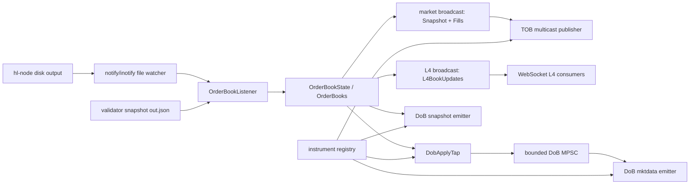
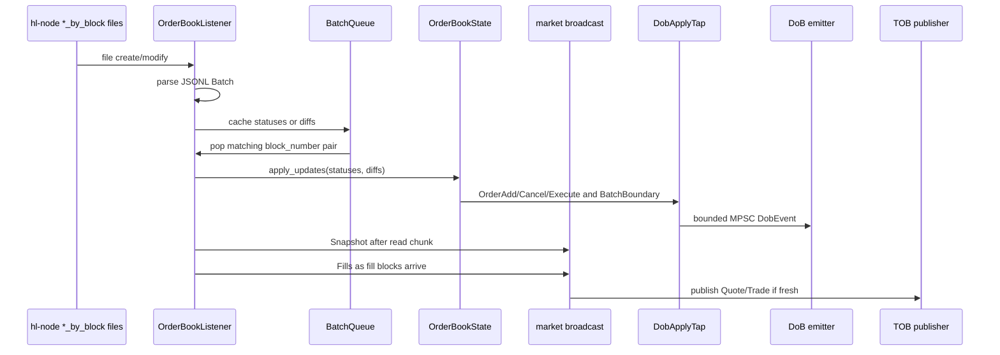
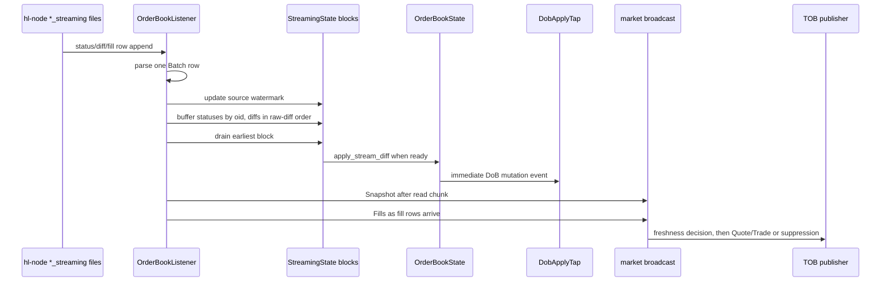
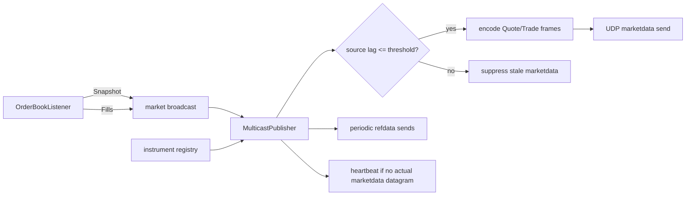
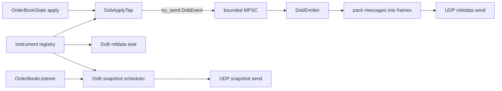

# Architecture

This document is a mental model for the order book server. It is intentionally
organized around runtime dataflow and publishing hot paths, rather than around
the file tree alone.

The main binary is `dz_hl_publisher` in
`binaries/src/bin/dz_hl_publisher.rs`. It can serve WebSocket clients, publish
top-of-book (TOB) multicast, publish depth-of-book (DoB) multicast, and expose
Prometheus metrics. Production deployments in this repo mostly use it as a
multicast publisher.

## High-Level Model

At runtime the process has four major responsibilities:

1. Tail Hyperliquid validator output files.
2. Maintain an in-memory L4 order book.
3. Fan book changes into TOB and DoB publishers.
4. Periodically validate internal state against validator snapshots.



Important source files:

| Area | Files |
|------|-------|
| Binary and CLI | `binaries/src/bin/dz_hl_publisher.rs` |
| Runtime orchestration | `server/src/servers/websocket_server.rs` |
| File ingest and listener state | `server/src/listeners/order_book/mod.rs` |
| Book mutation logic | `server/src/listeners/order_book/state.rs`, `server/src/order_book/` |
| DoB apply tap | `server/src/listeners/order_book/dob_tap.rs` |
| TOB multicast publisher | `server/src/multicast/publisher.rs` |
| DoB multicast emitters | `server/src/multicast/dob.rs` |
| Wire formats | `server/src/protocol/`, `server/src/protocol/dob/` |
| Metrics | `server/src/metrics.rs` |
| E2E/parity tests | `server/src/listeners/order_book/block_mode_multicast_e2e.rs` |

## Process Startup

`dz_hl_publisher` parses CLI flags and constructs:

- `IngestMode`: `block` or `stream`.
- Optional TOB `MulticastConfig`.
- Optional DoB `DobConfig`.
- Optional Prometheus metrics listener.

It then calls `run_websocket_server`. The function name is historical: this is
also the top-level coordinator for multicast-only deployments.

`run_websocket_server` creates two internal Tokio broadcast channels:

- `market_message_tx`: carries `InternalMessage::Snapshot` and
  `InternalMessage::Fills` for TOB and WebSocket L2/trade consumers.
- `l4_message_tx`: carries `InternalMessage::L4BookUpdates` for WebSocket L4
  consumers. TOB does not subscribe to this high-volume channel.

If TOB or DoB is enabled, a shared instrument registry is also created. TOB uses
it to map coins to instrument definitions. DoB uses it to resolve internal coins
to on-wire instrument IDs and quantity exponents.

## Hyperliquid Disk Inputs

The listener reads three logical event streams:

| EventSource | Block mode directory | Streaming mode directory |
|-------------|----------------------|--------------------------|
| `Fills` | `node_fills_by_block` | `node_fills_streaming` |
| `OrderStatuses` | `node_order_statuses_by_block` | `node_order_statuses_streaming` |
| `OrderDiffs` | `node_raw_book_diffs_by_block` | `node_raw_book_diffs_streaming` |

Each row is a JSONL `Batch<E>` with:

- `block_number`
- `block_time`
- `local_time`
- `events`

The listener uses the `notify` crate to watch the relevant directories and then
tails files with normal file reads. On startup or file rotation it seeks to a
recent JSONL boundary so it does not parse a partial middle of a large row. For
partial trailing JSONL lines, it rewinds only the unread suffix so already
applied complete rows are not replayed.

## Snapshots and Initialization

The listener does not publish book data until it has initialized from a
validator snapshot. Snapshot validation reads `out.json`, loads it into
`OrderBooks`, and records the snapshot height.

After initialization:

- Block mode applies matched status/diff block pairs after the snapshot height.
- Streaming mode drops buffered stream blocks at or below the snapshot height
  and then drains the remaining stream buffer.
- Every validation interval, the listener compares its computed L4 snapshot
  with a fresh validator snapshot.

When validation finds a per-coin divergence, the listener repairs only affected
coins. If DoB is enabled, this recovery also emits an `InstrumentReset` and
queues a priority DoB snapshot for the affected instrument.

## Block Mode Hot Path

Block mode assumes the validator writes one row per block per source. The hot
path pairs a whole order-status block with a whole raw-diff block and applies
them atomically.



Key properties:

- `BatchQueue` synchronizes statuses and diffs by `block_number`.
- `OrderBookState::apply_updates` is the book mutation boundary.
- Raw-book `New` diffs use direct resting-order insertion, not local matching.
  The validator diff already represents venue-decided book state.
- DoB batch boundaries are emitted around blocks with multiple emittable DoB
  mutations.
- Fills publish TOB trades but do not mutate book state.
- TOB snapshots are emitted once per file-read chunk, not per individual diff.

Block mode should remain backward-compatible. The streaming implementation uses
separate code to accumulate rows, but both modes eventually call the same raw
diff application semantics in `OrderBookState`.

## Streaming Mode Hot Path

Streaming mode reads the `_streaming` directories, where multiple rows can
arrive for the same block. A raw diff row may arrive before the order-status row
that contains required metadata for a `New` order.



Streaming accumulation rules:

- Raw book diffs are the mutation-order authority.
- A `New` raw diff waits for its matching opening status by `(block_number,
  oid)`.
- `Update` and `Remove` diffs apply immediately in raw-diff order.
- Later diffs in the same block wait behind an unresolved earlier `New`, so
  mutation order is preserved.
- Fills are independent of book state and publish through the market channel.

### Streaming Finalization

Streaming finalization closes a block and emits the DoB close boundary when the
listener knows it has seen the relevant raw diffs for that block.

Healthy steady-state uses source watermarks:

- `diff_watermark`: latest raw-diff block observed.
- `status_watermark`: latest order-status block observed.
- A block can finalize in watermark mode once the diff watermark has advanced
  beyond it and all buffered diffs for that block are drained.

Startup is special. The process can begin tailing in the middle of a block, with
one source already ahead of another. To avoid closing a block before matching
statuses have appeared, startup begins in grace fallback until both status and
diff watermarks have crossed the startup sync height.

Out-of-order meaningful rows activate a temporary grace fallback. Late
meaningful diffs after finalization are fatal because they would mutate a closed
DoB block. Late statuses after finalization are metadata-only unless a pending
raw diff can consume them, so they are counted and ignored.

## TOB Publishing Hot Path

TOB has two UDP channels:

- Marketdata: `Quote`, `Trade`, `Heartbeat`, `EndOfSession`.
- Refdata: `ChannelReset`, `InstrumentDefinition`, `ManifestSummary`.

The TOB publisher subscribes only to `market_message_tx`. It receives:

- `InternalMessage::Snapshot` for quotes.
- `InternalMessage::Fills` for trades.

It intentionally ignores `InternalMessage::L4BookUpdates`, so high-volume L4
traffic cannot evict TOB snapshots from the TOB receiver.



TOB freshness is independent from streaming finalization. The publisher
computes source lag at the final publish decision:

```text
source_lag_ms = now_at_tob_publisher - message_block_time
```

If the message is older than the freshness threshold, stale quote/trade
marketdata is suppressed. Heartbeats and refdata can still be emitted. Activity
tracking is based on actual marketdata datagrams, so suppressed messages do not
starve heartbeats.

Important latency components:

- Validator/source lag: `local_time - block_time`.
- File tail lag: `now - local_time` for the newest processed row.
- Snapshot source block lag: newest source row block time minus emitted snapshot
  block time.
- Listener-to-publisher lag: source row `local_time` to TOB publisher receive.
- TOB queue delay: listener enqueue to publisher receive.
- Socket send time: UDP send call duration.

When TOB suppression occurs, compare these metrics before changing the
freshness threshold. High validator/source lag with low file-tail lag means the
row is already old when the validator writes it. High queue delay points at
internal publisher contention. High snapshot source block lag points at book
finalization or snapshot production falling behind the newest source rows.

## DoB Publishing Hot Path

DoB has three UDP streams:

- Mktdata: `OrderAdd`, `OrderCancel`, `OrderExecute`, `BatchBoundary`,
  `InstrumentReset`, `Heartbeat`, `EndOfSession`.
- Refdata: `InstrumentDefinition`, `ManifestSummary`.
- Snapshot: `SnapshotBegin`, `SnapshotOrder`, `SnapshotEnd`.

The DoB mktdata path is closer to the book mutation hot path than TOB. Events
are produced synchronously from `DobApplyTap` when the book mutates, then sent
through a bounded MPSC to the async emitter.



Key properties:

- The DoB channel is bounded. If it fills, `DobApplyTap` drops events and
  increments `orderbook_dob_channel_drops_total`.
- Per-instrument sequence numbers are advanced at the tap, before enqueue.
- Mktdata frame sequence is shared with recovery and snapshot anchoring.
- Snapshot stream sequence is independent, but each snapshot carries the
  mktdata `anchor_seq`.
- Recovery emits `InstrumentReset`, reserves a future mktdata anchor, and
  schedules a priority snapshot for the affected instrument.

DoB backpressure must be treated as a correctness issue. Unlike TOB freshness
suppression, dropped DoB mutation events can make downstream reconstructed books
inconsistent until reset/snapshot recovery.

## Internal Channels

There are three notable fanout boundaries:

| Boundary | Type | Carries | Main risk |
|----------|------|---------|-----------|
| `market_message_tx` | Tokio broadcast | TOB/WebSocket `Snapshot` and `Fills` | Receiver lag can drop internal messages before TOB sees them. |
| `l4_message_tx` | Tokio broadcast | WebSocket `L4BookUpdates` | High-volume L4 traffic should not affect TOB. |
| DoB MPSC | bounded Tokio MPSC | `DobEvent` | Full queue drops DoB mutation events. |

Broadcast lag and bounded-channel drops are intentionally different failure
modes. Broadcast lag is receiver-side loss on an internal pub-sub channel. DoB
MPSC full is producer-side backpressure at the apply tap.

## Metrics and Observability

Metrics are served from a dedicated Axum HTTP listener on `/metrics`.

The most useful triage sequence is:

1. Check `orderbook_ingest_source_gossip_seconds`.
   High values mean the validator row is already late relative to block time.
2. Check `orderbook_ingest_file_tail_lag_seconds`,
   `orderbook_ingest_file_mtime_lag_seconds`, and
   `orderbook_ingest_backlog_bytes`.
   High values here mean local tailing or processing is behind.
3. Check `orderbook_stream_finalization_mode` and
   `orderbook_stream_finalization_lag_seconds`.
   Watermark mode should dominate after startup.
4. Check `orderbook_tob_snapshot_source_block_lag_seconds`,
   `orderbook_tob_snapshot_listener_to_publisher_seconds`, and
   `orderbook_tob_queue_delay_seconds`.
   These identify whether TOB snapshots are delayed before or inside the
   publisher.
5. Check `orderbook_dob_queue_delay_seconds` and
   `orderbook_dob_channel_drops_total`.
   DoB drops indicate loss before wire emission.

The README contains the full metric reference.

## Tests and Fixtures

The highest-value tests live in
`server/src/listeners/order_book/block_mode_multicast_e2e.rs`.

Coverage includes:

- Block-mode multicast e2e tests using real reduced Hyperliquid fixtures.
- Dual-validator block-vs-stream fixture parity tests.
- TOB parser downstream tests against `edge-multicast-ref` when explicitly
  enabled.
- Streaming finalization and partial JSONL regression tests.
- DoB packet sequencing and golden payload checks.

For hot-path changes, run at least:

```bash
cargo test -p server listeners::order_book::block_mode_multicast_e2e -- --nocapture
cargo test -p server dual_validator_fixture_matches_block_and_stream_goldens -- --nocapture
cargo test -p server
cargo clippy --workspace --all-targets
```

## Common Failure Modes

### TOB marketdata suppressed

The TOB publisher suppresses stale quote/trade frames when source lag exceeds
the freshness threshold. This is a safety behavior: subscribers should receive
heartbeats/refdata instead of stale prices.

Root-cause with:

- `validator_write_lag_ms` in suppression detail logs.
- `listener_to_publisher_ms`.
- `publisher_queue_ms`.
- `orderbook_tob_snapshot_source_block_lag_seconds`.
- `orderbook_ingest_file_tail_lag_seconds`.

### `multicast: caught up ..., publishing quotes`

This means the TOB publisher was suppressing stale snapshots, then saw a
snapshot under the freshness threshold and resumed quote publishing. Frequent
near-threshold messages mean source lag is hovering around the freshness cutoff.

### Streaming finalization falls back to grace mode

This happens during startup synchronization or after meaningful out-of-order
streaming rows. It is conservative and preserves block closure correctness at
the cost of latency.

### Late finalized streaming diffs

Meaningful late diffs are fatal because they would mutate an already-finalized
streaming block. Late statuses are counted and ignored once no pending raw diff
can consume them.

### Missing update/remove warnings

These indicate the book did not contain an order referenced by a raw diff. The
common causes are missing prior `New` metadata, startup in the middle of a
block, or source ordering issues. Snapshot validation and per-coin recovery are
the long-term safety net, but persistent warnings should be investigated.

### DoB unknown coin

`dob_tap` logs unknown coins when an applied mutation cannot resolve to an
active instrument. This usually points at stale or incomplete instrument
metadata. The mutation still applies to the internal book, but no DoB event is
emitted for that coin.

## Design Constraints

- Block mode remains supported and is the compatibility baseline.
- Streaming mode is opt-in and optimized for lower latency.
- Fills do not mutate book state.
- Raw-book `New` diffs insert resting orders directly; they do not invoke local
  matching.
- TOB and DoB are independent outputs. Enabling DoB must not disable TOB.
- TOB subscribers should not be required to derive TOB from DoB.
- DoB drops are correctness-significant.
- Metrics labels must stay low-cardinality. Do not add coin, oid, block height,
  or subscription labels.

